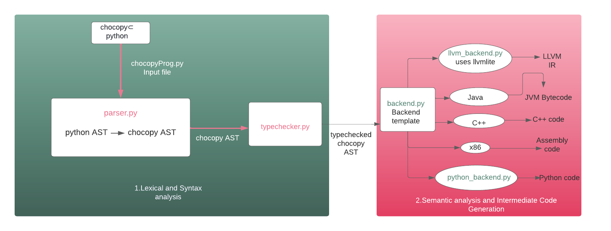

# Chocollvm
A compiler frontend to convert a subset of the [ChocoPy](https://chocopy.org/) programming language into LLVM human-readable IR code. This compiler (and the subset of ChocoPy it compiles) were designed for the Compiler Design course (UE19CS351) at PES University.

Inspired by (and taking significant portions from) https://github.com/yangdanny97/chocopy-python-compiler

## Setup
You will need
- Python 3.8
    - llvmlite==0.38.0
- LLVM tools (specifically, `lli`)

If you are familiar with `pipenv`, you can use it to set up the dependencies as follows -
```sh
pipenv install
pipenv shell
```

If you do not wish to use `pipenv`, you can set up the dependencies with Python's built-in `venv` as follows -
```sh
python -m venv .venv
source .venv/bin/activate # On Windows, replace this with '.venv/bin/activate.bat'
pip install -r requirements.txt
```

## Language description
See the [spec](./SPEC.md)

## Project Objectives
See the [project objectives](./IMPLEMENT.md)

## Using the CLI
`main.py` provides a CLI interface to operate the compiler and perform various actions.
```
python main.py --help
usage: main.py [-h] [--mode {parse,tc,python,llvm}] [--test] [input]

Chocollvm - a ChocoPy compiler frontend

positional arguments:
  input                 ChocoPy file to process

optional arguments:
  -h, --help            show this help message and exit
  --mode {parse,tc,python,llvm}
                        Modes:
                        parse    - output AST in JSON format
                        tc       - output typechecked AST in JSON format
                        python   - output untyped Python 3 source code (default)
                        llvm     - output LLVM IR code
  --test                run all test cases
```

Some useful commands are -
- `python main.py --mode tc <input>`: Generates the typechecked AST for a ChocoPy program. This helps in understanding the structure to traverse for generating LLVM IR code, and the types of various entities in a program
- `python main.py --mode llvm <input> | lli`: Generate LLVM IR code for a program and execute it
- `python main.py --test`: Run the test suite

### A diagrammatic overview of chocollvm
Please refer to the video resources [provided](https://drive.google.com/drive/folders/1Xc3tFMkWHIvOepwZyWj1mSYqwy-0RLWg?usp=sharing) for a comprehensive explanation.

