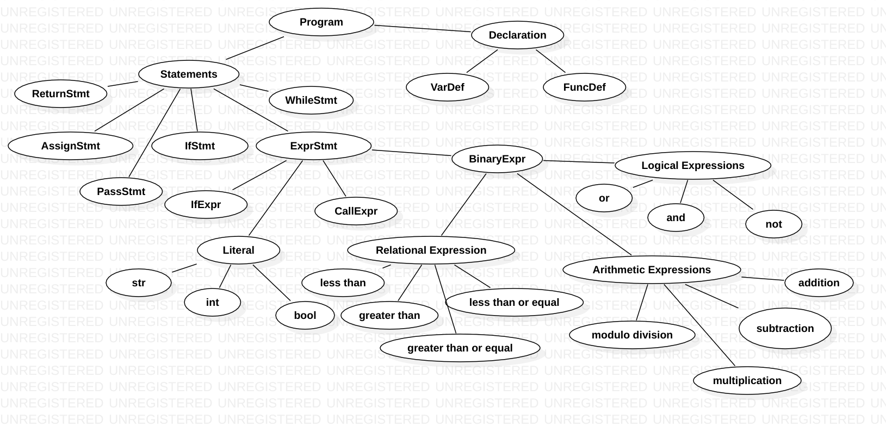

# Language specification
This document is a formal specification of the language features supported by this compiler. It is a subset of the features described in the official [ChocoPy language specification](https://chocopy.org/chocopy_language_reference.pdf), and where relevant, language is consistent with that specification.

_Note_: This document **does not** describe the set of features to be implemented as part of the project. For that, read the [project objectives](./IMPLEMENT.md).

## Overview
ChocoPy is a statically typed dialect of Python 3.6. It is designed to be a subset of Python. Almost every valid ChocoPy program is also a valid Python 3.6 program. An execution of a ChocoPy program that does not result in error usually has the same observable semantics as the execution of that program in Python 3.6. A ChocoPy program is contained in a single source file.

In the rest of this document, the following notation is used -
- `{expr}` to denote an expression in the program
- `{id}` to denote an identifier such as the name of a variable or function
- `{stmts}` to denote a list of program statements, separated by newlines
- `{declarations}` to denote a list of (possibly interleaved) declarations of functions, variables and/or attributes where applicable
- `{type}` to denote a static type annotation
- `{literal}` to denote a constant literal such as an integer literal, a string literal, or the keywords `True`, `False` or `None`

## Program structure
A program consists of zero or more definitions followed by zero or more statements, referred to as top-level definitions and statements respectively. Top-level definitions include global variable definitions and function definitions. These definitions create new mappings in a scope called the global scope.

Global variables are defined using the syntax `{id}:{type} = {literal}`, where the identifier specifies the variable name, the type annotation specifies the static type of the variable, and the constant literal specifies the initial value of the variable upon program execution. The names of global variables and global functions must be distinct. Top-level statements execute in the global scope; that is, expressions in top-level statements may reference entities defined in the global scope using identifiers. A ChocoPy program's execution begins with the first top-level statement and ends when the last top-level statement is executed completely.

## Functions
A function definition can only appear at the top level of a program. Functions cannot be redefined. A function definition has the following form:
```
def {id} ({id}: {type}, ..., {id}: {type}) {return type}:
	{declarations}
	{stmts}
```
where `{return type}` is either empty or has the form `-> {type}`.

The first line defines the function's name, a comma-separated list of zero or more formal parameters in parentheses, and the function's return type after the `->` symbol. When the return type is empty, the function may only return the value `None`. Every formal parameter has a name and a static type annotation.

The body of a function contains a sequence of zero or more declarations followed by a sequence of one or more program statements. A function definition creates a new scope. Declarations in a function body include local variable definitions of the form `{id}:{type} = {literal}` (note that this is the same format as toplevel declarations). Such a definition declares a local variable with the name id, explicitly associates it with a static type, and specifies an initial value using a literal. If a variable is not explicitly declared in a function or passed as an argument, it cannot be used within the function i.e, there are no global variables.

## Values
The following value types are supported -
### Integers
Integers are signed and are represented using 32 bits. The range of integers is from −231 to (231 − 1). Arithmetic operations that cause overflow lead to undefined behavior in program execution.
### Booleans
There are exactly two boolean values: True and False.
### Strings
Strings are immutable sequences of characters. String literals are delimited with double quotes, e.g. `"Hello World"`. Strings do not support any operations.

## Expressions
The following categories of expressions are supported: literals, identifiers, arithmetic expressions, logical expressions, relational expressions and call expressions.
### Literals and identifiers
The basic expression is a constant literal or a variable. Literals are of type `str`, `bool` or `int`. Variables evaluate to the value contained in the variable. If an identifier is bound to a global function, then it is not a valid expression by itself — it can appear only in specific expressions such as call expressions. This is because ChocoPy does not support first-class functions.
### Arithmetic expressions
The following arithmetic expressions are supported on two operands each of type `int`: 
- `{expr} + {expr}`
- `{expr} - {expr}`
- `{expr} * {expr}`
- `{expr} % {expr}`

These operators perform integer addition, subtraction, multiplication and division remainder (modulo) respectively. The unary expression `-{expr}` evaluates to the negative of the integer-valued operand. Arithmetic operations return an `int` value.
### Logical expressions
The following logical operations are supported on operands of type `bool`:
- `not {expr}`
- `{expr} and {expr}`
- `{expr} or {expr}`

which evaluate to the logical negation, conjunction, and disjunction of their operands respectively. Logical expressions return a `bool` value.
### Relational expressions
The following relational expressions are supported on operands of type `int`:
- `{expr} < {expr}`
- `{expr} <= {expr}`
- `{expr} > {expr}`
- `{expr} >= {expr}`

Additionally, the operands in the expressions of the form `{expr} == {expr}` and `{expr} != {expr}` can be of types `int` or `bool`, as long as both operands are of the same type. The `==` and `!=` operators return `True` if and only if their operands evaluate to respectively equal or unequal values of integers or booleans.
### Conditional expressions
The expression `{expr1} if {expr0} else {expr2}` first evaluates `{expr0}`, which must have type `bool`. If the result is `True`, then `{expr1}` is evaluated and its result is the value of the expression. Otherwise, `{expr2}` is evaluated and its value is the value of the expression.
### Call expressions
A call expression is of the form `{id}({expr},...)`, where `{expr},...` is a comma-separated list of zero or more expressions provided as arguments to the call. If the identifier is bound to a globally declared function, the expression evaluates to the result of the function call.

## Type annotations
Static type annotations are used to explicitly provide types for variables and attributes, formal parameters and return types of functions. Annotations are provided as the name of the type following the identifier to be annotated.

## Statements
### Expression statements
The simplest statement is a standalone expression. The expression is evaluated and its result is discarded. These types of statements are useful when they have side-effects. E.g. `print("Hello")`
### Compound statements: conditionals and loops
ChocoPy supports the Python-like `if-elif-else` syntax for conditional control flow, with `elif`s and `else`
being optional.

The statement:
```
if {expr1}:
	{body1}
elif {expr2}:
	{body2}
elif {expr3}:
	{body3}
```
is equivalent to:

```
if {expr1}:
	{body1}
else:
	if {expr2}:
		{body2}
	else:
		if {expr3}:
			{body3}
```
The expressions in the `if` and `elif` conditions must have type `bool`. The body immediately following an `if` or `elif` condition is only evaluated if the expression evaluates to `True`. If the expression evaluates to `False`, then subsequent `elif` or `else` blocks are considered. The body following the `else` arm is only evaluated if all of the preceding condition expressions evaluate to `False`.

For looping, the language supports a simple `while` loop, which has the following structure:
```
while {expr}:
	{body}
```
The expression must be of type `bool`. The body is repeatedly evaluated as long as the expression evaluates to `True` between iterations.
### Assignment statements
An assignment statement can be of the form  `{id} = {expr}`, which assigns a value to the variable bound to the identifier {id}. A single assignment may assign the same value to several different destinations. For example, the code `x = y = z = 1` assigns the integer value 1 to three memory locations: the variables `x`, `y` and `z`, in that order. That is, the final expression (the right-hand side) is evaluated first. The result is then assigned to the left-hand sides (left of the = symbols, that is), evaluating these from left to right.
### Pass statement
The pass statement is a no-op. The program state does not change and control flow simply continues on to the next statement.
### Return statement
The return statement terminates the execution of a function and optionally returns a value using the `return {expr}` syntax. If a return value is not specified, then the `None` value is returned. It is illegal for a return statement to occur at the top level outside a function body. During a function’s execution, if
control flow reaches the end of the function body without encountering a return statement, then the `None`
value is implicitly returned. Consider the following example:
```
def bar(x: int) -> object:
	if x > 0:
		return
	elif x == 0:
		return None
	else:
		pass
```
In function `bar`, the execution of the function can terminate either because 
- `x > 0`, and a return statement with no return value is executed
- `x == 0`, and an explicit `return None` is executed
- `x < 0`, and the control flow reaches the end of the function, implicitly returning None

In functions or methods that declare a return type of `int`, `str`, or `bool`, all execution paths must contain a return statement with an expression that is not a `None` literal.

## Predefined types and functions
The types `int`, `str` and `bool` are predefined, and may be used in any ChocoPy program. In addition, a rudimentary `printf` function has been provided to display values and verify program execution. This version of `printf` is highly limited - it takes exactly two arguments, the first being a format string and the second, a value to replace the placeholder in the format string. The placeholder `%d` can be used for integers and booleans, while `%s` must be used for strings. Note that exactly two arguments must be provided. The compiler will raise errors if more or less arguments are provided. This means that a format string will have exactly one placeholder per function call

## The chocollvm AST syntax
Here is a diagrammatic representation of the nodes of the chocollvm ast.
Please refer to the video resources [provided](https://drive.google.com/drive/folders/1Xc3tFMkWHIvOepwZyWj1mSYqwy-0RLWg?usp=sharing) for a comprehensive explanation of the chocollvm ast.
